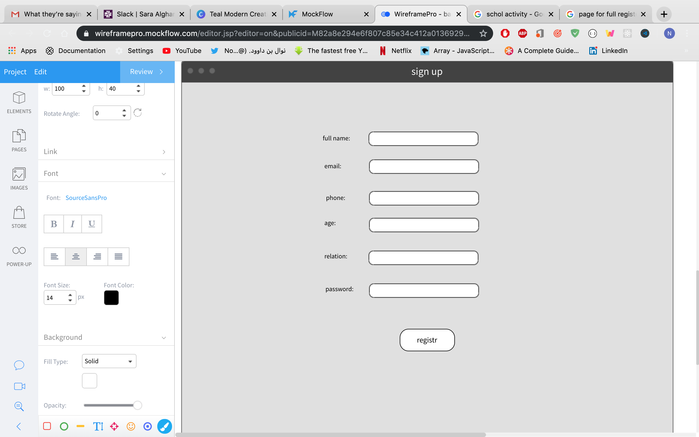
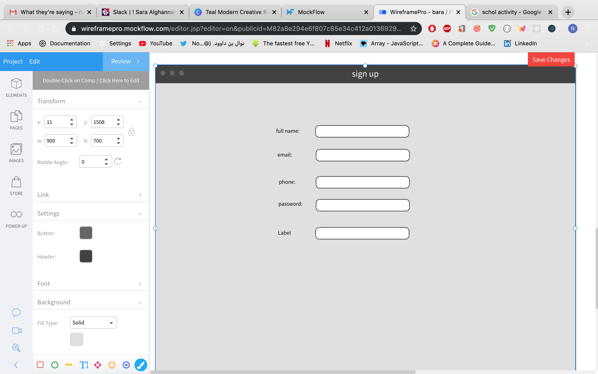
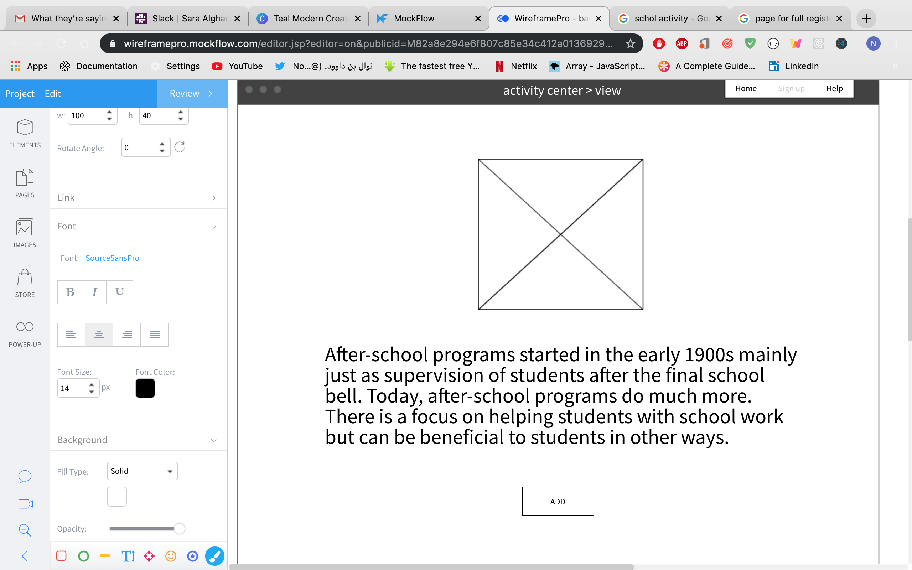
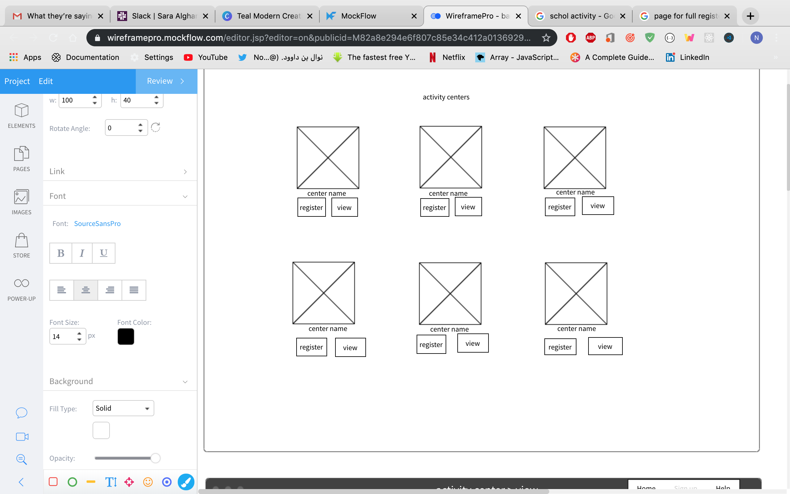

## Project Name:
بارع 

## Description
Our children needs the best of what we can give them, parents provide unconditional love, they are
always looking to develop their kids socially to build their personalities, their minds, and body, and in this
busy lives searching and looking for the best suitable place that satisfies our needs we get lost
searching, reading, this is why we developed (بارع ) to help our beloved parents meet their needs in
one unified platform that serves for different fields and for all ages.

## User Stories

Parent Story:
- As a parent I can sign in.
- As a parent I can sign up.
- As a parent I can log out.
- As a parent I can update my profile.
- As a parent I can add childrens. 
- As a parent I can view all activity center. 
- As a parent I can reigester my children in activity center. 
- As a parent I can view activity center details. 
- As a parent I can delete . 

## Technology:
- React
- express 
- API
- Visual Studio Code 
- Postman

## Wirframes

## ER Diagram
https://app.creately.com/diagram/l1fXLEZAFs0/edit

## Future Work 
- Register children in more than one center 
- Adding Comments for Centers 
- Rating 
- Category and Filters for Centers
- Adding diffrent classes for each center 
- Payment after Booking a class 
- Schedule Activities 
